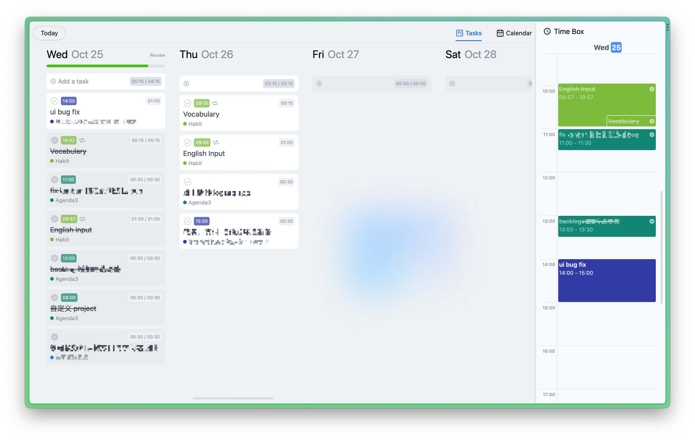
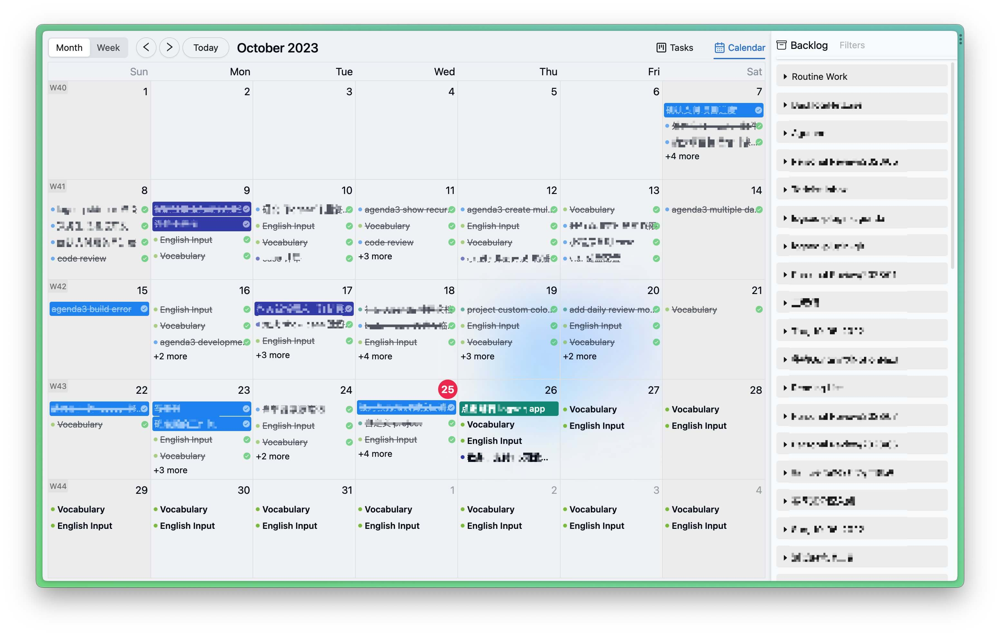
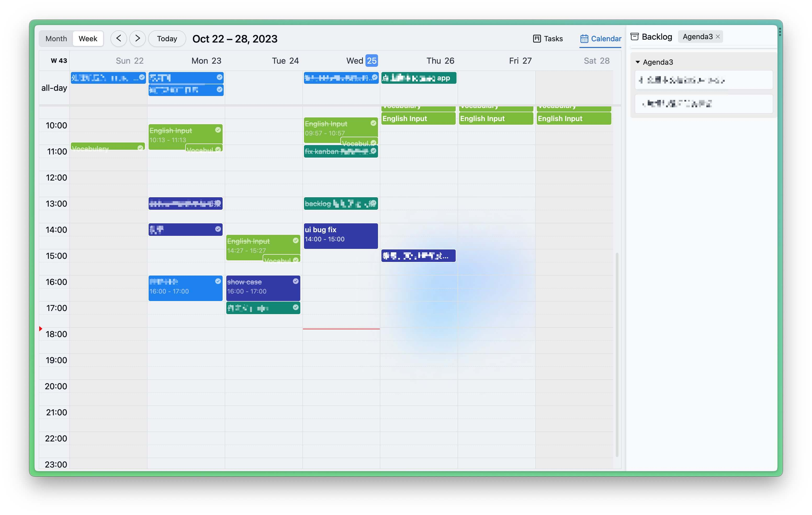
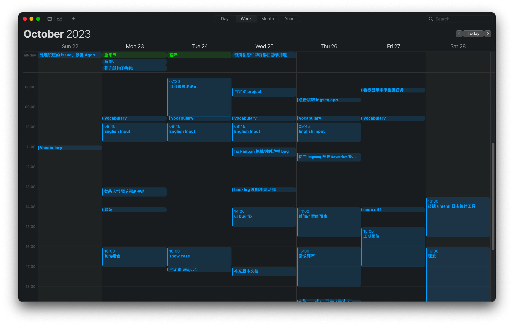

# logseq-plugin-agenda
> A calendar plugin for logseq

To access the documentation, please refer to the following links based on the version you are using.

For version 2.0, you can find the documentation at https://haydenull.github.io/logseq-plugin-agenda/.

If you are using version 3.0, please visit https://haydenut.notion.site/Agenda3-ef115e277c864de3b2679d6bda0e6376 for the documentation

If you want to contribute, please visit [contribution guide](./CONTRIBUTING.md)

## 🎨 Features
- Supports Kanban
- Supports Calendar
- Supports agenda sharing
- Supports use as a webpage or plugin
<!-- - Supports dashboard
- Supports sidebar
- Supports dark mode
- Supports calendar view
- Supports gantt view
- Supports timeline view
- Supports subscription calendar(basic event)
- Supports pomodoro timer -->

<!-- 

 -->

## Star History

