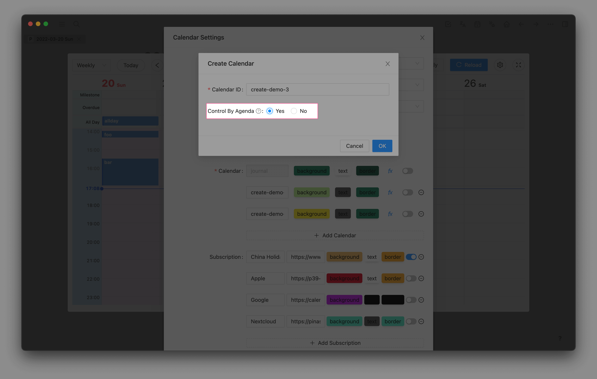

# Agenda Calendar

::: tip
Agenda Calendar supports creating, editing, and deleting operations in the calendar view.
:::

When creating a calendar, select `Control By Agenda` to create an agenda calendar.

When the Agenda calendar is created, the plugin will create a new page with the same name in logseq to save the events under the calendar.

## Create Event

Double click in the calendar view to bring up the edit window. After filling in the information, save it.

## Edit Event

Click the event and click Edit in the details window to edit it.

If you only want to modify the event time, you can drag the event in the calendar view.

## Delete Event

Click the event and click Delete in the details window to delete it.