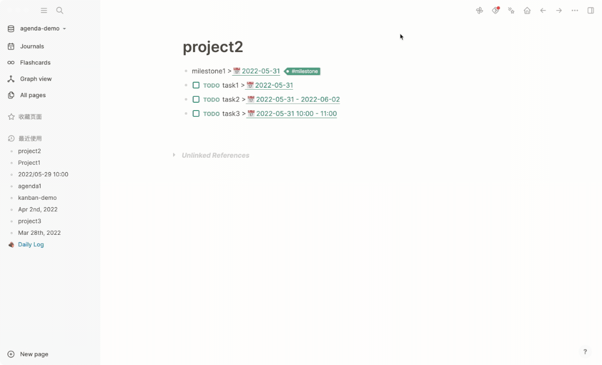

# Modify Event

1. Click on events in the calendar and select `Edit`
2. Use block right-click menu or slash command `Agenda: Modify Schedule` to set the date
3. For the Agenda link task with the calendar icon, click the date directly

