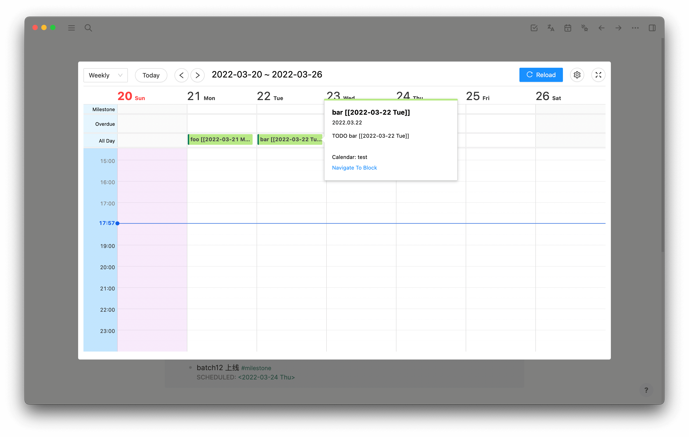

# Query Example

## Use journal page instead of scheduled

[issue19](https://github.com/haydenull/logseq-plugin-agenda/issues/19)

note:


The configuration is as follows:

Query Script:
```clojure
[:find (pull
  ?block
  [:block/uuid
    :block/parent
    :db/id
    :block/left
    :block/collapsed?
    :block/format
    :block/_refs
    :block/path-refs
    :block/tags
    :block/content
    :block/marker
    :block/priority
    :block/properties
    :block/pre-block?
    :block/scheduled
    :block/deadline
    :block/repeated?
    :block/created-at
    :block/updated-at
    :block/file
    :block/heading-level
    {:block/page
      [:db/id :block/name :block/original-name :block/journal-day :block/journal?]}
    {:block/refs
      [:block/journal-day]}])
  :where
  [?block :block/marker ?marker]
  [?rp :block/journal? true]
  [?block :block/refs ?rp]
  [(contains? #{"TODO" "DOING" "NOW" "LATER" "WAITING" "DONE"} ?marker)]]
```

Schedule Start:
`refs[0].journal-day`

Date Formatter:
`yyyyMMdd`


Calendar:


## Exclude specified page from default journal calendar

Defaut journal calendar will search all pages, but you can exclude some pages by setting query script.

If you want to exclude a page named `your project`, you can add the following code to your query script:
```clojure
  [?page :block/name ?pname]
  [?block :block/page ?page]
  (not [(contains? #{"your project"} ?pname)])
```

The original query script of query1 is as follows:
```clojure
[:find (pull ?block [*])
  :where
  [?block :block/marker ?marker]
  [(missing? $ ?block :block/deadline)]
  (not [(missing? $ ?block :block/scheduled)])
  [(contains? #{"TODO" "DOING" "NOW" "LATER" "WAITING" "DONE"} ?marker)]]
```

The script after the modification is as follows:
```clojure{6-8}
[:find (pull ?block [*])
  :where
  [?block :block/marker ?marker]
  [(missing? $ ?block :block/deadline)]
  (not [(missing? $ ?block :block/scheduled)])
  [?page :block/name ?pname]
  [?block :block/page ?page]
  (not [(contains? #{"your project"} ?pname)])
  [(contains? #{"TODO" "DOING" "NOW" "LATER" "WAITING" "DONE"} ?marker)]]
```