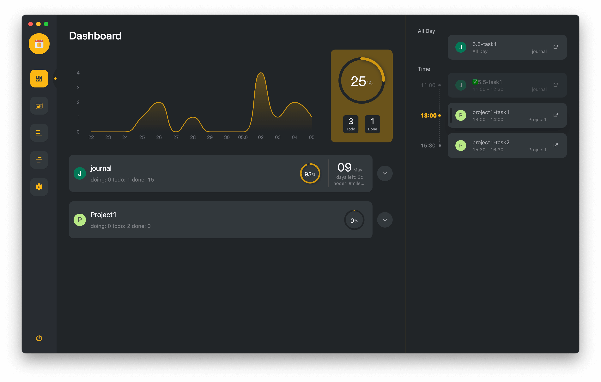
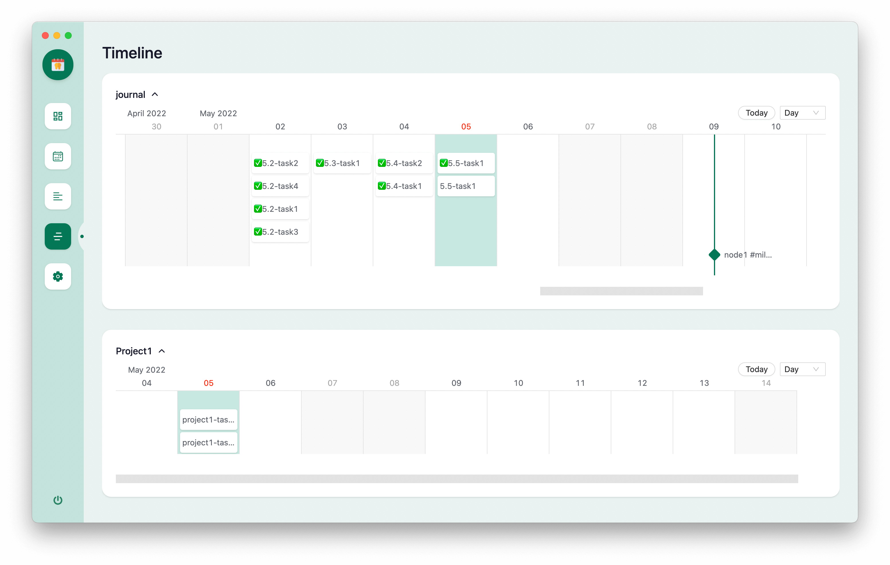

# 介绍
> logseq 日程管理插件

<!-- ::: warning 注意
原本的 journalDateFormatter 配置需要用户理解 dayjs 文档才能正确填写，1.8.1 版本移除了 journalDateFormatter 设置，改为自行从 logseq 获取，非常遗憾的是这个改动影响了原本的日期解析，如果你遇到报错 `Use yyyy instead of YYYY (in YYYYMMDD) for formatting` ，请在设置中点击 fx 按钮，将所有的 `YYYYMMDD` 改为 `yyyyMMdd`
::: -->

## 🎨 功能
- 支持工作台
- 支持侧边栏
- 支持夜间模式
- 支持日历视图
- 支持甘特图视图
- 支持时间线视图
- 支持订阅日历
- 支持番茄钟

<!-- 

 -->
