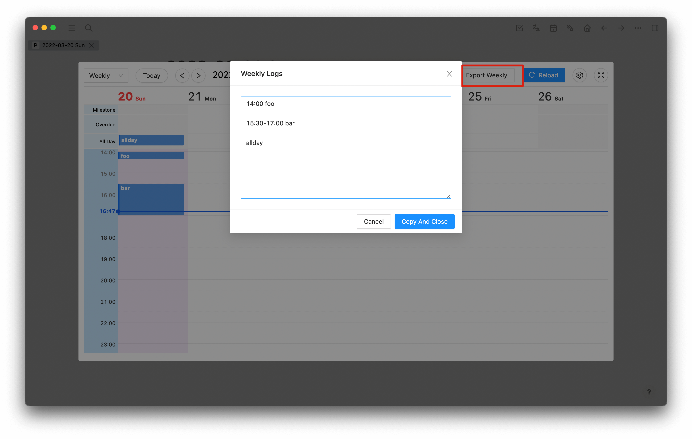

# daily log 记录

插件会依据`Log Key`设置的关键字,将所有日记中该 block 下的内容收集起来, 在日历中展示

有以下三种情况:
1. 具有时间点的 block, 如: 14:00 foo, 则会被认为是 `time` 日程
3. 具有时间范围的 block, 如: 14:00-16:00 foo, 则会被认为是 `time` 日程
2. 没有时间点的 block, 如: foo, 则会被认为是 `all day` 日程

以 Log Key 为 `Daily Log` 为例：

日记:

日历:

当 Log Key 被启用后, 日历的周视图上方会出现 `Export Weekly` 按钮, 点击后可以将当前周的日程展示出来并支持复制

