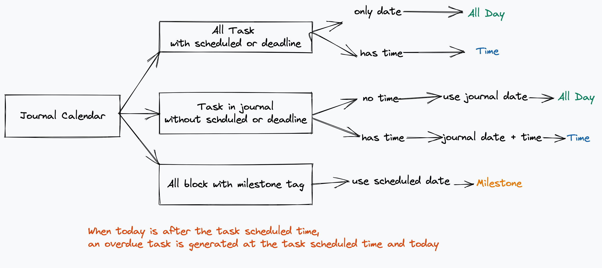

# 默认 journal 日历

默认的 journal 日历将会收集以下笔记并展示在日历中:
1. 所有有 scheduled 或 deadline 的任务(使用 `scheduled` `deadline` 作为任务计划时间)
2. 所有 journals 中没有 scheduled 或 deadline 的任务(使用 journals 的日期作为任务计划时间)
3. 所有具有 milestone 标签的 block

## 创建、编辑、删除 journal 日历事件

操作与 agenda 日历事件一致, 但是 journal 事件会存储在 journal 日记中, 并且不支持持续多天的事件。

点击[这里](../calendar/agenda.md)查看 agenda 日历。