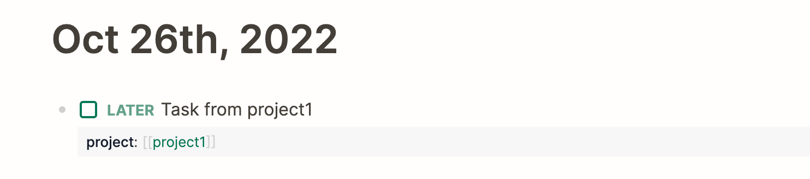

# 事件

事件分为两类：
- journal：日记中的任务
- project：其他笔记中的任务

## Journal

以日记的日期作为任务的日期, 任务以时间开头时, 将其视为任务的具体时间.

::: tip
可以使用 project 属性, 设置任务所属项目
:::

示例:

## Project

支持以下方式设置任务日期:
- 日期双链引用: `task [[Jun 10th, 2022]]`
- scheduled
- deadline
- agenda 链接: (鼠标右键 block 圆点, 选择"Modify Schedule")
- start end 属性

示例:

## 里程碑: 一类特殊的事件

当事件带有 milestone 标签时, 将会在日历和甘特图中单独显示

### Example:

